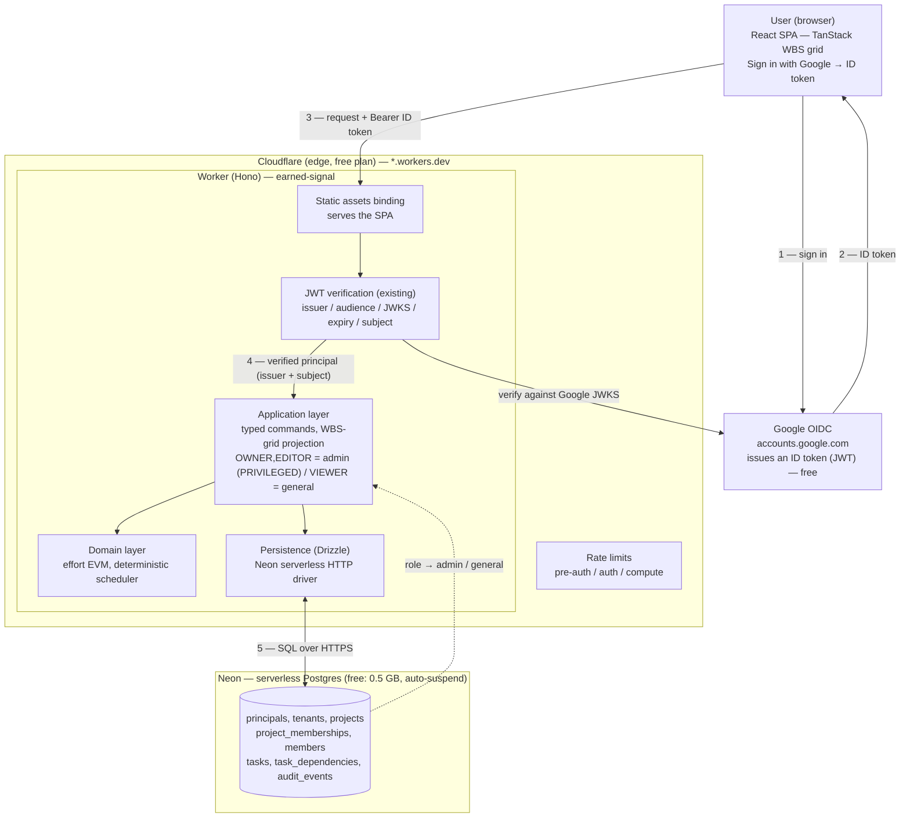

# Deployment architecture — authenticated, DB-backed (all free tier)

Target for taking the effort-WBS app from the current no-auth hosted preview to a real,
persistent, authenticated deployment — entirely on free tiers, with **no custom domain**.

**Stack choice:** Google OIDC ("Sign in with Google") + Cloudflare Workers (`*.workers.dev`)
+ Neon serverless Postgres via its HTTP driver.

- **Login = Google OIDC.** The Worker already verifies an OIDC Bearer JWT (issuer, audience,
  JWKS, expiry, subject), so login is mostly configuration: point those vars at Google
  (`https://accounts.google.com` + Google's certs) and add a "Sign in with Google" flow in the
  SPA that attaches the ID token to API calls. Free, and works on a bare `*.workers.dev` host.
- **No Hyperdrive** → no paid-plan requirement. The trade-off is a small persistence-layer
  driver swap (`pg` → `@neondatabase/serverless`).
- **Alternative:** if a custom domain is added to Cloudflare later, **Cloudflare Access**
  (Zero Trust) can front the Worker and inject the JWT instead of an in-app login — but Access
  cannot protect a bare `*.workers.dev` host, so it is out of scope for the fully-free path.

## Diagram

## Request & auth flow

1. In the SPA the user clicks **Sign in with Google** and authenticates with their Google
   account.
2. Google returns an **ID token** (a signed JWT) to the browser.
3. The SPA calls the Worker API with `Authorization: Bearer <id token>`.
4. The Worker **verifies the JWT** against Google's issuer + JWKS (audience = the Google OAuth
   client id), looks up the matching **`principals`** row, and resolves **tenant/project
   access**.
5. The **role** on `project_memberships` decides the read model: **`OWNER`/`EDITOR` → admin
   (PRIVILEGED)** see every field; **`VIEWER` → general** get a projection with sensitive fields
   (member capacity; later, rate/productivity) **absent** — enforced at the API boundary
   (implementation step ⑦), not hidden in the UI.

## What is placeholder today vs. supplied per environment

| Setting | Committed (placeholder) | Real value at deploy |
|---|---|---|
| `OIDC_ISSUER` | `*.example.invalid` | `https://accounts.google.com` |
| `OIDC_JWKS_URL` | `*.example.invalid/...` | `https://www.googleapis.com/oauth2/v3/certs` |
| `OIDC_AUDIENCE` | placeholder | the Google OAuth **client id** |
| Database connection | Hyperdrive id `0000…` (unused on this route) | Neon connection string, stored as a **Worker secret** — never committed |
| Admin identity | — | the admin Google account, applied only at **seed time** — never committed |

Confidentiality: no real identities, connection strings, client ids, or account values live in
the repository. OIDC/DB config is set as Worker vars/secrets per environment; the admin identity
is used only by the one-off seed. The reference worksheet under `.wbs-private/` is never read.

## One-time setup checklist

1. **Google OAuth client**: in Google Cloud Console, create an OAuth 2.0 **Web** client
   (authorized JavaScript origin = the Worker's `*.workers.dev` URL). Copy the **client id**
   (this becomes `OIDC_AUDIENCE`). No cost.
2. **Neon**: create a free project → copy the connection string (kept as a Worker secret).
3. **Code**: swap the persistence driver to `@neondatabase/serverless`; add the SPA
   "Sign in with Google" flow that attaches the ID token; point the OIDC vars at Google.
4. **Migrate + seed**: apply the schema; seed one tenant + project and a `principals` +
   `project_memberships (OWNER)` row for the admin Google account.
5. **Deploy**: set OIDC vars + the DB secret; `wrangler deploy`; verify sign-in → admin edit →
   reload persists → a VIEWER identity sees no sensitive fields.

## Free-tier limits (fine for personal / small use)

- Cloudflare Workers: 100k requests/day; bare `*.workers.dev` host, no custom domain needed.
- Google OIDC: free.
- Neon: 0.5 GB storage, compute auto-suspends on idle (first query after idle has a short
  cold-start). No Hyperdrive → no paid-plan requirement.
